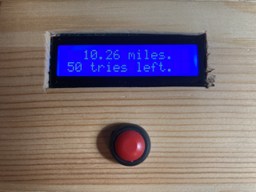

# Reverse Geocache Box
A gift box, locked from the inside, that will only open at a special location that can be set by the giver. 

When the button is pressed the box displays how far away they currently are. They must travel a few miles and check again to see if they are getting closer or further away from the destination! The receiver of the box only has so many tries to triangulate in on the special location.

When they finally arrive at the correct location the box unlocks to present any gifts inside, a message is displayed and a special tune is played!

### Arduino Project Parts

This can be built using pretty much any Atmel microcontroller including ATTiny85's if you only implement the LiquidCrystal_I2C, PWMServo, and SoftwareSerial that talks to the GPS module, and the GPS module itself. All other parts are optional.

### Required
* Wooden craft box from a craft/hobby store. Pick any size and shape, there are a lot of great choices that make good project boxes.
* 2 18650 Lipo rechargeable batteries with holder
* Pushbutton
* LM2931A 5V LDO regulator
* 0.1 µF capacitor
* 100 µF capacitor
* Arduino Uno, Nano or any other Atmel processor with at least 4 pins available. 1 pin is needed for the servo, 1 pin is needed for the serial Rx from the GPS module, and 2 pins are needed for the I2C bus. On Uno, Nano and Arduino platforms larger than ATTiny85 you can also use up to 8 pins to play polyphonic MIDI music as I have done here, 2 pins are used as a secret backdoor so that as a developer you don't lock yourself out of the box!
* 1602 Liquid Crystal I2C display
* Small Servo. I used a metal gear digital mg90.
* Serial GPS module

### Optional
* Solid state power button (https://www.adafruit.com/product/1400) NOT SHOWN IN SCHEMATIC!
* 2W tiny speaker. You could also use a piezo disc.
* Audio amplifier module
* resistors, capacitors, wire

